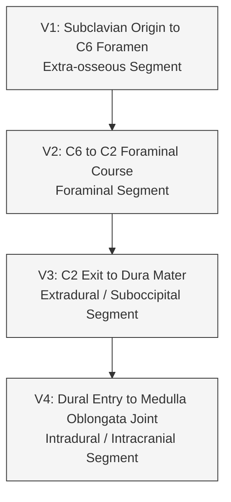
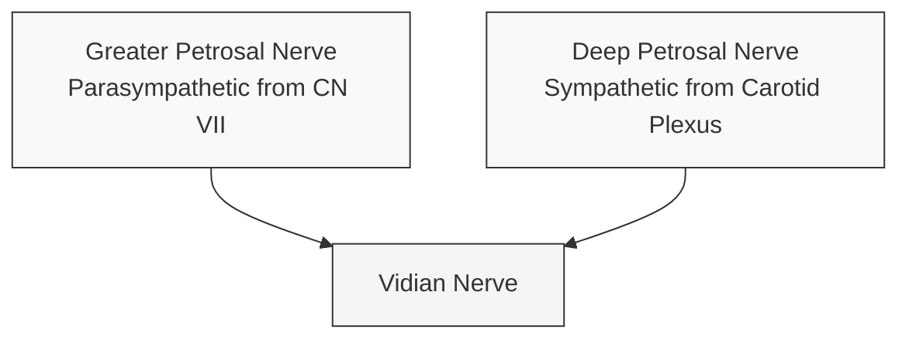

# Refactor Manual Note Contract

This contract defines the canonical workflow and formatting guidelines for converting raw, manually taken study notes (from grand rounds, lectures, or clinical discussions) into polished, active-recall-friendly Obsidian notes designed for deep, permanent understanding.

---

## 1. Workflow & Output Discipline

* **Input**: `/refactor-manual-note <note-path-or-content>`. Resolve the argument to one source note — a vault path, an attached file, or pasted text. If it is a path, read the full file before refactoring.
* **In-place rewrite**: Refactor the note at its existing path and overwrite that file. Never create a second file, never add a `(Refactored)` or date suffix, never rename — the filename is the note title and must be preserved. If the input is pasted text with no path, ask Gabriel for the destination path before writing.
* **Preserve, don't invent**: This is a reorganize-and-format pass over Gabriel's own notes. Restructure the content, add the curated visuals defined below, and tighten prose — but never fabricate clinical facts, silently drop content, or discard an embedded image reference.
* **Bottom YAML & indexing**: Keep any existing bottom YAML or add the block in §D; `domain:` is a canonical AGENTS.md slug (Vascular, Skull Base, Tumor, Spine, Trauma, Neurocritical Care, Functional, Pediatric, Peripheral Nerve, Anatomy, General), closed by a final `---`. After writing, regenerate the folder index with `python3 src/index_builder.py <Folder>` only for agent-indexed folders (Reports, Operative Guides, Concepts, Consults, Reference); leave script-guarded folders (Study Material, Brain Dumps, Presentations) to their own guards.
* **Incremental re-refactor (growing an existing note)**: When Gabriel says he is adding new material to an already-refactored note — or the note is already in refactored shape (bottom YAML plus Mermaid/callouts/tables present) — do **not** re-refactor, reword, or restructure the existing polished content. Treat the existing note as a fixed scaffold whose only job is to tell you *where the new material belongs*. Refactor **only** the new raw content, then merge each piece into the section it fits, matching the surrounding voice and visual conventions; open a new section or subsection only for a genuinely new topic. Preserve existing diagrams, tables, callouts, and image embeds verbatim unless the new material directly extends or corrects one (then extend it in place, minimally). Never duplicate a point that already exists — merge into it. Finish by re-anchoring the bottom YAML to the true end of the file and widening `summary`/`tags` only if scope actually grew. Gabriel does not use a scratch heading; identify the new material from his instruction and its position (typically appended just above the bottom YAML).

---

## 2. Core Principles

### A. Subject-First Hierarchy
* **Concept over Procedure**: Structure the notes around core anatomical divisions, physiological systems, or pathological categories rather than surgical approaches (unless the note is explicitly an operative guide).
* **Self-Emergent Classification**: Let headers and subheaders emerge naturally from the raw note's content. Do not force notes into rigid global templates.
* **No Redundant H1s**: Never place a top-level H1 header repeating the note title at the top of the note. In Obsidian, the filename serves as the H1.

### B. Selective Visual Curation & Formatting Guardrails
Do not visually represent every fact. Limit diagrams and tables to the following specific patterns, and adhere strictly to these rendering guardrails:

1. **Sequential Transitions & Flow**:
   * For simple linear sequences (e.g. dural peeling steps), use inline arrow trails (`Step 1` ➔ `Step 2` ➔ `Step 3`...) instead of heavy vertical flowcharts.
   * For complex branching pathways or segments, use Mermaid flowcharts (`flowchart TD` or `flowchart LR`).
   * **CRITICAL RENDER GUARDRAIL**: Never prefix node labels with numbers followed by periods (e.g., `1. Tegmen`) or closing parentheses (e.g., `1) Tegmen`). GFM/CommonMark list engines will try to parse these inside the node, rendering a broken box containing `"Unsupported markdown: list"`. Always use colons (e.g., `"1: Tegmen Tympani"`) or remove numbers completely.
   * Node text with spaces or special characters must be wrapped in double quotes: `V1["V1: Subclavian..."]`.

2. **Spatial Geography & Cross-Sections**:
   * Represent 2D/3D layouts (e.g., the quadrants of the IAC) as spatial markdown tables rather than complex flowcharts or prose.

3. **Shortest-Path Wikilinks & Vertical Flow for Images**:
   * Refer to all embedded image attachments using the shortest path format: `![[Image Name.png]]` without subfolder paths.
   * Keep figures in the vertical flow, centered or left-aligned, sized for clear visibility (e.g. `![[Image Name.png|450]]`), with descriptive figure captions underneath. Avoid squeezing images into narrow multi-column panels.

4. **Targeted Discrimination Tasks & Direct Table Flow**:
   * Identify natural comparative pairings (e.g., thoracic vs. lumbar mechanics, or Vernet vs. Collet-Sicard vs. Villaret syndromes).
   * Isolate these inside side-by-side comparative tables that explicitly highlight the "gatekeeper" or distinguishing features.
   * **CRITICAL PLACEMENT RULE**: Place all comparative and reference tables directly in the main note content (not nested inside callouts or columns). This ensures tables utilize the full width of the screen and render with correct theme margins and colors.
   * **ALIGNED PIPE SYNTAX**: Align column boundary pipes (`|`) in the raw markdown source file for high raw-text readability.

### C. Reference Callout Blocks
Use standard callouts to capture critical information without cluttering the main text:
* `> [!WARNING]`: Used for high-risk surgical hazards, critical anatomical variants (e.g., ponticulus posticus), and safety thresholds. Start with a bold title: `> [!WARNING] **Title**`.
* `> [!TIP]`: Used for high-yield mnemonics, study tips, and quick association rules. Start with a bold title: `> [!TIP] **Title**`.
* **Standard Callouts Only**: Avoid custom layout modifiers like `|clean` or `|no-icon` as they can render incorrectly on vanilla themes; instead, use the scoped CSS overrides block below.

### D. Scoped CSS Styling Block
To ensure tables and callouts render with a publication-grade, professional review-book layout (proper padding, readable font weights, soft alternating rows, hover highlights, and border shadows) on all themes, always append the following scoped HTML `<style>` block at the very bottom of the note, directly above the YAML block:
```html
<style>
  /* Scoped visual overrides for publication-grade reference styling */
  .markdown-rendered table {
    width: 100% !important;
    border-collapse: collapse !important;
    margin: 2em 0 !important;
    font-size: 0.9em !important;
    box-shadow: 0 1px 3px rgba(0, 0, 0, 0.05) !important;
  }
  .markdown-rendered th {
    background-color: var(--background-secondary) !important;
    color: var(--text-normal) !important;
    font-weight: 700 !important;
    padding: 12px 16px !important;
    border: 1px solid var(--background-modifier-border) !important;
    text-transform: uppercase !important;
    font-size: 0.85em !important;
    letter-spacing: 0.5px !important;
  }
  .markdown-rendered td {
    padding: 12px 16px !important;
    border: 1px solid var(--background-modifier-border) !important;
    line-height: 1.6 !important;
    vertical-align: top !important;
  }
  .markdown-rendered tr:nth-child(even) {
    background-color: var(--background-primary-alt) !important;
  }
  .markdown-rendered tr:hover {
    background-color: var(--background-modifier-hover) !important;
  }
  .callout {
    background-color: var(--background-primary-alt) !important;
    border: 1px solid var(--background-modifier-border) !important;
    border-left: 4px solid var(--callout-color) !important;
    box-shadow: 0 1px 3px rgba(0, 0, 0, 0.02) !important;
    padding: 14px 18px !important;
    margin: 1.5em 0 !important;
    border-radius: 4px !important;
  }
  .callout-title {
    font-weight: 700 !important;
    font-size: 0.95em !important;
    margin-bottom: 6px !important;
  }
</style>
```

### E. Obsidian Bottom YAML
Always append the standard Obsidian frontmatter block to the **very bottom** of the file (following the style block and closed by a final `---` boundary) to allow indexers to parse it. Always include `table-wide`, `row-highlight`, and `table-small` helper classes:
```yaml
---
domain: [domain_name]
summary: [One-line summary of the note contents]
tags: [abns, neuroanatomy, tags_related]
cssclasses: [table-wide, row-highlight, table-small]
---
```

---

## 3. Refactored Exemplar Note

Below is the canonical exemplar of a manual note refactored under this protocol.

### Spine Osteology & Joint Mechanics

* **Cervical Spine (C1–C2) Screw Placement**:
  * Cervical screws most often go into the **pars compacta**.
  * **C2 nerve roots** are sometimes sacrificed when performing cervical screw placements.
  * C1 lateral mass screw placement requires **inferior displacement** of the C2 nerve root and the surrounding venous plexus. C2 sacrifice makes this maneuver significantly easier.
  * *Functional consequence:* C2 innervates occipital sensation but has no motor function, so sacrifice does not produce motor deficits.
  * *Vertebral Artery Risk:* ACDF (Anterior Cervical Discectomy and Fusion) poses a potential risk for vertebral artery injury due to its lateral proximity to the vertebral body.

* **Posterior Spinal Landmarks**:
  * The posterior view of the spine does **not** reveal the intervertebral disc, which is located in the **anterior** portion of the spine between the vertebral bodies.
  * At **T2–T11**, the lateral facet joint border is flush with the lateral border of the pedicle (the structure located directly anterior to the lateral facet). This is a helpful anatomical landmark for placing thoracic pedicle screws.

* **Facet Joint Orientations & Kinetics**:

  | Region | Joint Face Direction | Anatomical Plane | Primary Motion Allowed | Analogy / Visual |
  |---|---|---|---|---|
  | **Thoracic** | Posteriorly and slightly superiorly | Coronal / Axial | Axial rotation | Slanted tiles sliding rotationally |
  | **Lumbar** | Lateral and outward | Sagittal | Flexion & Extension | Clapping hands vertically (mimicking sagittal contact) |

* **Pars Interarticularis & Spondylolisthesis**:
  * The pars interarticularis is the bony bridge connecting the superior and inferior articular processes of a single vertebra.
  * A fracture through this bridge disconnects the anterior vertebra (body) from the posterior vertebra (arch and processes).
  * **The same vertebra with the pars fracture is the one that slips anteriorly.**

* **Sacral Osteology & Kambin's Triangle**:
  * **Alar screws** are placed at the inferolateral corner of the first dorsal sacral foramen and aimed toward the greater trochanter.
  * **Kambin's Triangle**: The anatomical safe zone targeted during a transforaminal lumbar interbody fusion (TLIF). The bony work requires cutting bone from the superomedial edge of the superior articulating process down to the level of the pars, and then out laterally (forming a right-angle window) to visualize this space.

  ![[Screenshot 2026-06-14 at 10.04.07 AM.png]]
  *Figure 1: Right-angle window bony work exposing Kambin's triangle for cage placement.*

---

### Cranial Vascular Systems & Segments

* **Vertebral Artery Segments (V1–V4)**:



  * **V3 Segment Details**: Courses over the *sulcus arteriosis*, a groove in the C1 arch.

  > [!WARNING]
  > **Ponticulus Posticus (Arcuate Foramen)**: A common anatomical variant where the sulcus arteriosis on the posterior arch of C1 is bridged by bone, forming a complete ring (arcuate foramen). This variant can compress the V3 segment and significantly increases the risk of vertebral artery laceration during C1 lateral mass screw placement.

  ![[Pasted image 20260614102510.png]]
  *Figure 2: Vertebral artery segments and suboccipital course over the C1 arch.*

* **Internal Carotid Artery (ICA) Petrous Course**:
  * The carotid artery enters the skull through the **carotid canal**, which is a tunnel that takes a sharp 90-degree turn within the temporal bone.
  * The **foramen lacerum** is formed by the junction of the sphenoid, occipital, and temporal bones. It is closed from the bottom by a thick fibrocartilage membrane; the carotid artery runs superior to this membrane once it exits the carotid canal and does not actually pass through the foramen.

* **Venous Drainage & Sinuses**:
  * The **superior petrosal sinus** overlies the petrous ridge of the temporal bone.
  * The **inferior petrosal sinus** courses over the petroclival fissure and empties into the jugular foramen.
  * The **confluence of sinuses** (torcular herophili) is the convergence of the superior sagittal sinus, the straight sinus, and the transverse sinuses.

  ![[Pasted image 20260614115851.png]]
  *Figure 3: Configuration of the dural venous sinuses.*

---

### Cranial Base Osteology & Foramina

* **Anterior Cranial Fossa**:
  * **Foramen Cecum**: Located anterior to the crista galli.
  * *Clinical Correlation:* Transmits the nasal emissary vein when patent, bridging the extracranial venous system (nasal mucosa) with the intracranial venous system (superior sagittal sinus). Because emissary veins are valveless, blood can flow bidirectionally, presenting a potential (though rare) pathway for upper nasal infections to transmit into the intracranial venous system.

* **Middle Cranial Fossa & Petrous Bone**:
  * **Arcuate Eminence**: The bony prominence on the petrous bone overlying the superior semicircular canal.
  * **Sphenoidal Lingula**: The raised lateral edge of the carotid sulcus in the sphenoid bone.
  * **Hypophyseal Fossa**: The central depression of the sella turcica housing the pituitary gland:
    * *Anterior boundary:* Tuberculum sellae and the anterior clinoid processes.
    * *Posterior boundary:* Dorsum sellae and the posterior clinoid processes.

* **Middle Fossa Dural Peeling Sequence**:
  During a middle fossa surgical approach, the dura is peeled off the petrous bone in a specific anterior-to-posterior sequence to protect underlying structures:

```mermaid
flowchart LR
    Tegmen["1: Tegmen Tympani"] --> Arcuate["2: Arcuate Eminence"]
    Arcuate --> Meatal["3: Meatal Depression"]
    Meatal --> TrigP["4: Trigeminal Prominence"]
    TrigP --> TrigI["5: Trigeminal Impression"]

    style Tegmen fill:#f9f9f9,stroke:#333,stroke-width:1px
    style Arcuate fill:#f9f9f9,stroke:#333,stroke-width:1px
    style Meatal fill:#f9f9f9,stroke:#333,stroke-width:1px
    style TrigP fill:#f9f9f9,stroke:#333,stroke-width:1px
    style TrigI fill:#f9f9f9,stroke:#333,stroke-width:1px
```



* **Posterior Cranial Fossa & Infratemporal Space**:
  * The **internal auditory canal** is located just superior to the jugular foramen.
  * The **infratemporal fossa** lies immediately lateral to the lateral pterygoid plates.
  * **Pterygoid Muscle Kinesiology**:
    * *Medial Pterygoid:* Runs vertically; acts to **close** the mouth and move the jaw side-to-side.
    * *Lateral Pterygoid:* Runs horizontally; acts to **open** the mouth, move the jaw side-to-side, and **jut the jaw forward** (protrusion).

---

### Cranial & Autonomic Nerve Pathways

* **Internal Auditory Canal (IAC) Geography**:
  * **Porous Acousticus**: The medial opening of the internal auditory canal.
  * **Transverse Crest**: Separates the superior compartment (facial nerve, superior vestibular nerve) from the inferior compartment (cochlear nerve, inferior vestibular nerve).
  * **Vertical Crest (Bill's Bar)**: Separates the facial nerve (anterior) from the superior vestibular nerve (posterior).

  | | **Anterior** | **Posterior** |
  |---|---|---|
  | **Superior** | **Facial Nerve (CN VII)**<br>*(Seven)* | **Superior Vestibular Nerve**<br>*(Up)* |
  | **Inferior** | **Cochlear Nerve (CN VIIIc)**<br>*(Coke)* | **Inferior Vestibular Nerve (CN VIIIvi)**<br>*(Down - V8 on the back shelf)* |

  > [!TIP]
  > **IAC Quadrant Mnemonic**: *"Seven Up, Coke Down - V8 on the back shelf"*
  > * **Seven Up**: CN VII (Facial) is anterosuperior.
  > * **Coke Down**: Cochlear nerve is anteroinferior.
  > * **V8 on the back shelf**: The vestibular nerves (CN VIII branches) lie posteriorly.

  ![[Screenshot 2026-06-15 at 12.32.37 PM.png]]
  *Figure 4: Cross-section of the cochlear nerve fascicles entering the cochlea.*

  > [!WARNING]
  > **Gamma Knife Hearing Risk**: The cochlear nerve lacks a protective sheath as it branches into individual fascicles entering the cochlea (cochlear area). High radiation doses to these exposed fascicles during Gamma Knife treatment for vestibular schwannomas significantly increase the risk of post-treatment hearing loss.

  ![[Screenshot 2026-06-15 at 12.37.11 PM.png]]
  *Figure 5: The transverse crest dividing the superior and inferior compartments of the IAC.*

  ![[Screenshot 2026-06-15 at 12.38.05 PM.png]]
  *Figure 6: Bill's Bar (vertical crest) separating the facial and superior vestibular nerves.*

* **Trigeminal Nerve (CN V) & Rhizotomy**:
  * Rhizotomy needles are guided through the **foramen ovale** due to its relative size.
  * **Hartel's Landmarks for Foramen Ovale Cannulation**:
    * 2.5–3.0 cm lateral to the labial commissure (corner of the mouth).
    * 3.0–3.5 cm anterior to the tragus of the ear.
    * Aimed toward the ipsilateral pupil.

* **CN V3 (Mandibular Nerve) Innervation**:
  * Innervates **8 muscles** total (4 muscles of mastication, 4 ancillary muscles):
    * *Mastication:* Temporalis (elevates jaw), Masseter (elevates jaw), Medial Pterygoid, Lateral Pterygoid.
    * *Other:* Mylohyoid, anterior belly of the digastric, tensor veli palatini, tensor tympani.

* **Facial Nerve (CN VII)**:
  * Exits the skull base via the **stylomastoid foramen**.

  > [!WARNING]
  > **Surgical Landmark for CN VII**: The **posterior belly of the digastric** muscle must be identified and preserved during extracranial dissection; the facial nerve exits the stylomastoid foramen immediately medial and deep to this muscle belly.

* **Autonomic & Pathological Correlates**:
  * **Vidian Nerve (Nerve of the Pterygoid Canal)**:



  * **Sphenopalatine Neuralgia (Sluder's Neuralgia)**: Rare, severe facial pain disorder caused by irritation of the sphenopalatine ganglion.

  ![[Sphenopalatine Ganglion.png]]
  *Figure 7: Anatomic location of the sphenopalatine ganglion.*

  * **Endolymphatic Sac Tumors**: Highly vascular tumors of the temporal bone strongly associated with **von Hippel-Lindau (VHL) syndrome**.
  * **Jugular Foramen Compartments**:

  | Compartment | Alternative Name | Position | Transmitted Structures |
  |---|---|---|---|
  | **Pars Nervosa** | Petrosal part | Anterior | CN IX, Tympanic branch of CN IX (Jacobson's nerve), Inferior petrosal sinus |
  | **Pars Vascularis** | Sigmoid part | Posterior | CN X, CN XI, Superior jugular bulb, Auricular branch of CN X (Arnold's nerve), Posterior meningeal artery |

  * **Jugular Foramen & Related Syndromes**:

  | Syndrome | Involved Structures | Anatomical Localization | Key Differentiating Signs |
  |---|---|---|---|
  | **Vernet** | CN IX, X, XI | Intracranial (restricted to jugular foramen) | Isolated jugular foramen palsy |
  | **Collet-Sicard** | CN IX, X, XI, XII | Extracranial (extends down condylo-post-hypoglossal canal) | Adds tongue deviation/atrophy (CN XII) |
  | **Villaret** | CN IX, X, XI, XII + Sympathetics | Extracranial (retroparotid space lesion) | Adds **ipsilateral Horner Syndrome** (miosis, ptosis, anhidrosis) |

---
domain: anatomy
summary: High-yield anatomy review for the ABNS neuroanatomy exam, detailing spinal osteology, cranial vascular pathways, cranial base foramina, and cranial nerve trajectories.
tags: [abns, neuroanatomy, skull-base, spine]
---
